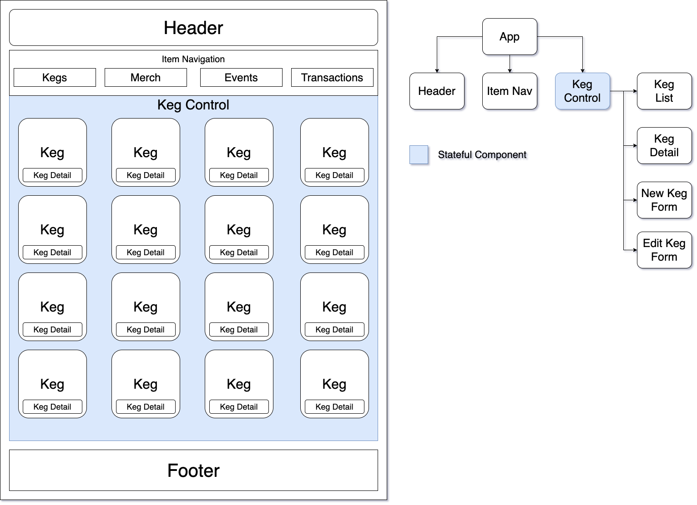

# Tap Room Redux Project

<h3 align="center">Tap Room Redux Project, 2-19-2021</h3>
<h4 align="center"> By Harrison Strand</h4>

## Description

This project was designed as a tap room keg and product manager using React-Redux, Javascript, CSS, Bootstrap, with state components and CRUD functionality. Users are able to create, update and manage stock for kegs and tap room merchandise using a one page web application 

## User Stories

  
Expand

| ID   | User Story                                                                                            | Accepted |
| ---- | ----------------------------------------------------------------------------------------------------- | -------- |
| US01 | "As a user, I want to see a list/menu of all available kegs. For each keg, I want to see its name, brand, price, pints left, and ABV."                       | True     |
| US02 | "As a user, I want to submit a form to add a new keg to a list."                                  | True     |
| US03 | "As a user, I want to be able to click on a keg to see its detail page."                                           | True     |
| US04 | "As a user, I want the option to edit a keg's properties after entering them just in case I make a mistake."                                           | True     |
| US05 | "As a user, I want to be able to delete a keg."                                           | True     |
| US06 | "As a user, I want a keg to update to say "Out of Stock" once it's empty."                                           | True     |
| US07 | "As a user, I want kegs with less than 10 pints to include a message that says "Almost Empty" so I can try a pint before it's gone!"                                           | True     |
| US08 | "As a user, I want to have kegs prices to be color-coded for easy readability."                                           | True     |
| US09 | "As a user, I want to see how many pints are left in a keg." | True     |
| US10 | "As a user, I want to be able to click a button next to a keg whenever I sell a pint of it. This should decrease the number of pints left by 1. Pints should not be able to go below 0."                  | True     |
| US11 | "As a user, I want to be able to click to view different categories of items."                  | True     |

## State Component Diagram

## Setup/Installation Requirements

##### Software Requirements

1. Internet browser
2. A code editor such as VSCode to view and edit the code

##### Open Locally

- Click on the link to my repository: [My Repository](https://github.com/HarrisonStrand/tap-room-redux)
- Click on the green "Code" button and copy the repository URL
- Open your terminal and use the command `git clone ` into the directory you would like to clone the repository
- Open in text editor to view code and make changes

# Getting Started with Create React App

This project was bootstrapped with [Create React App](https://github.com/facebook/create-react-app).

### Required Scripts

In the project directory, run:

### `npm install`

Installs all dependancies for the project in order to run the application

### `npm start`

Runs the app in the development mode.\
Open [http://localhost:3000](http://localhost:3000) to view it in the browser.

The page will reload if you make edits.\
You will also see any lint errors in the console.

## Available Scripts

### `npm test`

Launches the test runner in the interactive watch mode.\
See the section about [running tests](https://facebook.github.io/create-react-app/docs/running-tests) for more information.

### `npm run build`

Builds the app for production to the `build` folder.\
It correctly bundles React in production mode and optimizes the build for the best performance.

The build is minified and the filenames include the hashes.\
Your app is ready to be deployed!

See the section about [deployment](https://facebook.github.io/create-react-app/docs/deployment) for more information.

### `npm run eject`

**Note: this is a one-way operation. Once you `eject`, you can’t go back!**

If you aren’t satisfied with the build tool and configuration choices, you can `eject` at any time. This command will remove the single build dependency from your project.

Instead, it will copy all the configuration files and the transitive dependencies (webpack, Babel, ESLint, etc) right into your project so you have full control over them. All of the commands except `eject` will still work, but they will point to the copied scripts so you can tweak them. At this point you’re on your own.

You don’t have to ever use `eject`. The curated feature set is suitable for small and middle deployments, and you shouldn’t feel obligated to use this feature. However we understand that this tool wouldn’t be useful if you couldn’t customize it when you are ready for it.

## Learn More

  
Expand

You can learn more in the [Create React App documentation](https://facebook.github.io/create-react-app/docs/getting-started).

To learn React, check out the [React documentation](https://reactjs.org/).

### Code Splitting

This section has moved here: [https://facebook.github.io/create-react-app/docs/code-splitting](https://facebook.github.io/create-react-app/docs/code-splitting)

### Analyzing the Bundle Size

This section has moved here: [https://facebook.github.io/create-react-app/docs/analyzing-the-bundle-size](https://facebook.github.io/create-react-app/docs/analyzing-the-bundle-size)

### Making a Progressive Web App

This section has moved here: [https://facebook.github.io/create-react-app/docs/making-a-progressive-web-app](https://facebook.github.io/create-react-app/docs/making-a-progressive-web-app)

### Advanced Configuration

This section has moved here: [https://facebook.github.io/create-react-app/docs/advanced-configuration](https://facebook.github.io/create-react-app/docs/advanced-configuration)

### Deployment

This section has moved here: [https://facebook.github.io/create-react-app/docs/deployment](https://facebook.github.io/create-react-app/docs/deployment)

### `npm run build` fails to minify

This section has moved here: [https://facebook.github.io/create-react-app/docs/troubleshooting#npm-run-build-fails-to-minify](https://facebook.github.io/create-react-app/docs/troubleshooting#npm-run-build-fails-to-minify)

## Known Bugs

No known bugs...

## Support and Contact Details

If any errors or bugs occur with installation, please email me, <harrisonstrand@gmail.com>.

## Technologies Used

- VSCode
- Node
- React
- Redux
- CSS
- Javascript
- npm package installer

### License

This software is licensed under the [MIT License](https://choosealicense.com/licenses/mit/).

Copyright (c) 2021 Harrison Strand

